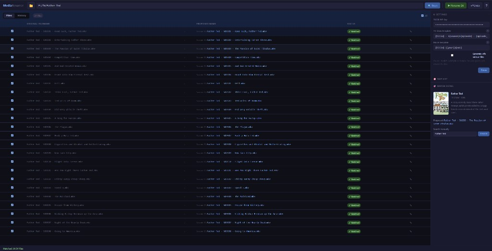

# MediaRenamer

You downloaded something called `Breaking.Bad.S01E05.720p.BRRip.x264-GROUP.mkv`. Plex wants `Breaking Bad - S01E05 - Gray Matter.mkv`. You could rename it by hand — or you could scan a folder, preview every change, and rename a whole library in one go.

MediaRenamer is a small local app that does exactly that. Point it at a folder, let it look up titles on [The Movie Database (TMDB)](https://www.themoviedb.org/), review the proposed names, and rename when you're happy. Nothing leaves your machine except TMDB API calls.

Built for Windows, runs in your browser at `http://127.0.0.1:8765`.

**Fair warning:** this whole thing is AI vibe-coding slop. It was prompted into existence, iterated until it felt right, and shipped without a proper design doc or test suite. It works for the happy path — scan, match, rename, undo — but don't expect elegant architecture, exhaustive edge-case handling, or code that a human would proudly defend in a code review. Treat it like a useful sketch, not production infrastructure. Preview before you rename.



---

## What it handles

- **TV shows** — parses `S01E05`, `1x05`, and similar patterns; fetches episode titles from TMDB
- **Movies** — picks up release years from filenames and matches against TMDB
- **Folder cleanup** — normalises season folders (`Season 1` → `Season 01`), moves TV episodes into the right season folder, and renames movie folders when a film sits alone in its own directory
- **Subtitles** — renames `.srt`, `.ass`, `.vtt`, and friends alongside their video file
- **Preview before you commit** — every rename is shown in a table; pick a different TMDB match if the first one is wrong
- **Undo** — roll back the last batch if something didn't look right
- **History** — browse past rename batches and undo older ones
- **Watch mode** — keep an eye on a download folder; new files show up automatically
- **Skip list** — right-click a file to ignore it on future scans
- **NFO sidecars** — optional `.nfo` files for Kodi, Plex, or Jellyfin

Supported video formats: `.mkv`, `.mp4`, `.avi`, `.mov`, `.m4v`, `.ts`, `.wmv`, `.flv`, `.webm`, `.m2ts`

---

## Quick start

**You'll need:** [Python 3](https://www.python.org/downloads/) (with "Add to PATH" ticked during install) and a free [TMDB API key](https://www.themoviedb.org/settings/api).

1. Clone or download this repo
2. Double-click **`start.bat`**

That's it. The script installs dependencies and opens the app in your browser. Leave the command window open while you use it — closing it stops the server.

### Manual start

```bat
pip install -r requirements.txt
python main.py
```

Then open [http://127.0.0.1:8765](http://127.0.0.1:8765).

---

## First run

1. Paste your **TMDB API key** in Settings (right panel) and click Save
2. Enter a folder path — e.g. `F:\TV\Lost\Season 1` — or click the folder button to browse
3. Click **Scan**
4. Wait for TMDB lookups to finish (progress bar at the bottom)
5. Click any row to see match details or switch to a different result
6. Click **Rename** when the proposed names look good

You can also drag a folder onto the window, or drop a path straight into the toolbar.

---

## Naming templates

Default patterns (editable in Settings):

| Type | Template |
|------|----------|
| TV | `{title} - S{season}E{episode} - {episode_title}{ext}` |
| Movie | `{title} ({year}){ext}` |

**TV tokens:** `{title}`, `{season}`, `{episode}`, `{episode_title}`, `{quality}`, `{ext}`

**Movie tokens:** `{title}`, `{year}`, `{quality}`, `{ext}`

Example output:

```
Breaking Bad - S01E05 - Gray Matter.mkv
The Dark Knight (2008).mkv
```

Click the **?** next to each template in the app for the full token list.

---

## Keyboard shortcuts

| Action | Shortcut |
|--------|----------|
| Scan folder | `Ctrl+S` |
| Rename selected | `Ctrl+Enter` |
| Undo last batch | `Ctrl+Z` |
| Browse for folder | `Ctrl+O` |
| History tab | `Ctrl+H` |
| Select all rows | `Ctrl+A` |
| Close / dismiss | `Esc` |

Press **?** in the toolbar to see these in the app.

---

## Where settings live

Config is stored locally, not in the project folder:

```
C:\Users\<you>\.mediarenamer\
  config.json      — API key, templates, last folder, watch list
  undo_log.json    — rename history for undo
  skip_list.json   — files you've told it to ignore
  cache\           — TMDB lookup cache
```

Your API key never gets committed to git.

---

## How it's built

Python backend ([FastAPI](https://fastapi.tiangolo.com/) + [Uvicorn](https://www.uvicorn.org/)), plain HTML/CSS/JS frontend. No build step, no Electron — just `python main.py` and a browser tab.

```
MediaRenamer/
  main.py           — starts the server, opens your browser
  start.bat         — install deps + run (Windows)
  app/              — scanner, TMDB client, renamer, watcher, API
  frontend/         — the UI
  requirements.txt
```

---

## A note on safety

Renames are real file moves on disk. The preview table exists so you can catch wrong matches before clicking Rename. If you do slip up, **Undo** reverses the most recent batch, and the History tab lets you roll back older ones too.

---

## License

No license file yet — treat this as personal-use software unless stated otherwise.
